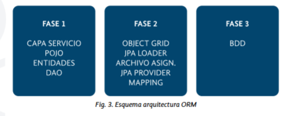
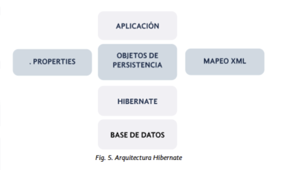

# Tema 7: Mapeo Objeto–Relacional (Hibernate + MySQL)

---

## 1️⃣ Introducción
En esta unidad aprenderás a conectar tu aplicación Java con una base de datos relacional usando el framework **Hibernate**, el ORM (Object Relational Mapping) más popular en Java.

📘 **Objetivos del tema:**
- Comprender el concepto de **Mapeo Objeto–Relacional (ORM)**.
- Conocer las **fases del mapeo** y los principales frameworks ORM.
- Aprender a **instalar y configurar Hibernate** en un proyecto Spring Boot.
- Crear una **app web con MySQL** que persista entidades Java.
- Configurar **logs** para monitorizar las operaciones SQL de Hibernate.

---

## 2️⃣ Qué es el Mapeo Objeto–Relacional (ORM)

Java trabaja con **objetos**, mientras que las bases de datos relacionales trabajan con **tablas**. El ORM sirve para **traducir entre ambos mundos**, evitando tener que escribir SQL manual.

🧩 **Ejemplo básico:**
Un objeto Java de tipo `Cliente`:
```java
class Cliente {
    private int id;
    private String nombre;
    private String email;
}
```
Se mapea con una tabla SQL:
```sql
CREATE TABLE clientes (
  id INT AUTO_INCREMENT PRIMARY KEY,
  nombre VARCHAR(100),
  email VARCHAR(100)
);
```
Hibernate realiza automáticamente este mapeo.

---

## 3️⃣ Ventajas e Inconvenientes del ORM

| ✅ Ventajas | ⚠️ Inconvenientes |
|-------------|-------------------|
| Mejora eficiencia desarrollo | Consumo de recursos |
| Desarrollo más orientado a objetos | Complejidad en consultas muy avanzadas |
| Manejabilidad | Curva de aprendizaje inicial |
| Facilidad para introducir nuevas funciones | Logs más extensos |

---

## 4️⃣ Fases del Mapeo Objeto–Relacional

1. **Fase 1: Objetos:**: Clases Java (POJOs) que representan entidades.  
2. **Fase 2: Persistencia:** Hibernate traduce objetos a registros SQL.  
3. **Fase 3: Relacional:** Los datos se almacenan realmente en MySQL.



🎥 [Vídeo 1: Esquema ORM](https://bit.ly/2EvTKy0)
---

## 5️⃣ Herramientas ORM más Usadas en Java

| Framework | Características |
|------------|----------------|
| **Ebean** | Consultas SQL y DTO; caché L2 y soporte para múltiples BBDD. |
| **MyBatis (iBatis)** | Control manual de consultas SQL, ideal para proyectos con SQL complejo. |
| **Hibernate** | Framework estándar JPA; potente, flexible y el más usado. |

En este tema trabajaremos con **Hibernate**, el ORM por excelencia.

---

## 6️⃣ Arquitectura y Componentes de Hibernate




🧠 **Componentes principales:**
- **SessionFactory:** Crea sesiones para comunicarse con la base de datos.
- **Session:** Representa la conexión activa a la base de datos.
- **Transaction:** Gestiona las operaciones atómicas (commit/rollback).
- **Query / HQL:** Lenguaje orientado a objetos para consultas.
- **Criteria:** API para consultas dinámicas sin SQL.

🗺️ **Esquema general:**
```
Aplicación Java → Hibernate ORM → Driver JDBC → MySQL
```

---

## 7️⃣ Instalación del Proyecto Spring Boot + Hibernate + MySQL

✅ Esto permite a Hibernate crear y actualizar automáticamente las tablas según las entidades.

### 🧩 Paso 1: Crear Proyecto en Spring Initializr

1. Entra en 👉 [https://start.spring.io](https://start.spring.io)
2. Configura:
   - **Project:** Maven
   - **Language:** Java
   - **Spring Boot:** versión estable
   - **Packaging:** jar
   - **Java:** 17 o superior
3. Añade dependencias:
   - `Spring Web`
   - `Spring Data JPA`
   - `MySQL Driver`
4. Pulsa **Generate** y descomprime el proyecto.


🎥 [Vídeo 2: Agregar Hibernate](https://bit.ly/2CYhCKd)

---

### 🧩 Paso 2: Dependencias en `pom.xml`

```xml
<dependencies>
    <dependency>
        <groupId>org.springframework.boot</groupId>
        <artifactId>spring-boot-starter-data-jpa</artifactId>
    </dependency>

    <dependency>
        <groupId>mysql</groupId>
        <artifactId>mysql-connector-j</artifactId>
        <scope>runtime</scope>
    </dependency>

    <dependency>
        <groupId>org.springframework.boot</groupId>
        <artifactId>spring-boot-starter-web</artifactId>
    </dependency>
</dependencies>
```

---
### 🧩 Paso 3 : Ficheros de configuración de hibernate
### ✅ OPCIÓN 1: Spring Boot + Hibernate + application.properties

📁 `src/main/resources/application.properties`

```properties
# Conexión a MySQL
spring.datasource.url=jdbc:mysql://localhost:3306/empresa_db?useSSL=false&serverTimezone=UTC
spring.datasource.username=root
spring.datasource.password=tu_contraseña
spring.datasource.driver-class-name=com.mysql.cj.jdbc.Driver

# Dialecto e inicialización
spring.jpa.hibernate.ddl-auto=update
spring.jpa.show-sql=true
spring.jpa.properties.hibernate.dialect=org.hibernate.dialect.MySQL8Dialect

# Logs de Hibernate
logging.level.org.hibernate.SQL=debug
logging.level.org.hibernate.type.descriptor.sql=trace
```

✔️ Spring Boot detecta las entidades @Entity automáticamente
✔️ No necesitas hibernate.cfg.xml
✔️ Hibernate es gestionado por Spring Boot: NO instancias SessionFactory a mano

📌 En tu clase main, sí debe existir @SpringBootApplication:

```java
@SpringBootApplication
public class DemoApplication {
    public static void main(String[] args) {
        SpringApplication.run(DemoApplication.class, args);
    }
}
```
---

### ✅ OPCIÓN 2: Hibernate clásico sin Spring Boot (hibernate.cfg.xml)

📁 `src/main/resources/hibernate.cfg.xml`

```xml
<?xml version="1.0" encoding="UTF-8"?>
<hibernate-configuration>
    <session-factory>
        
        <!-- Configuración de conexión -->
        <property name="hibernate.connection.driver_class">com.mysql.cj.jdbc.Driver</property>
        <property name="hibernate.connection.url">jdbc:mysql://localhost:3306/empresa_db</property>
        <property name="hibernate.connection.username">root</property>
        <property name="hibernate.connection.password">Med@c</property>

        <!-- Dialecto -->
        <property name="hibernate.dialect">org.hibernate.dialect.MySQL8Dialect</property>

        <!-- Crear o actualizar tablas -->
        <property name="hibernate.hbm2ddl.auto">update</property>

        <!-- Mostrar SQL -->
        <property name="hibernate.show_sql">true</property>
        <property name="hibernate.format_sql">true</property>

        <!-- Archivos XML de mapeo -->
        <mapping resource="Customer.hbm.xml"/>
        <mapping resource="Product.hbm.xml"/>
        <mapping resource="Order.hbm.xml"/>

    </session-factory>
</hibernate-configuration>
```

📌 En este modo:

Hibernate NO usa Spring Boot

Tú te encargas de instanciar Hibernate manualmente:

```java
public class Main {
    public static void main(String[] args) {
        SessionFactory sessionFactory =
                new Configuration().configure().buildSessionFactory();

        Session session = sessionFactory.openSession();
        session.beginTransaction();

        // ...

        session.getTransaction().commit();
        session.close();
        sessionFactory.close();
    }
}
```


➡️ Aquí NO debe existir la anotación @SpringBootApplication

Solo sería una clase Java ejecutándose con main().

---

## Resumen del Tema

| Concepto | Descripción |
|-----------|-------------|
| **ORM** | Traduce objetos Java a tablas SQL. |
| **Hibernate** | Framework JPA que facilita la persistencia. |
| **SessionFactory / Session** | Gestionan la conexión con la base de datos. |
| **`application.properties`** | Archivo de configuración de conexión y logs. |
| **HQL / Criteria** | Alternativas orientadas a objetos al SQL clásico. |
| **Spring Boot + Hibernate** | Combinación ideal para apps Java modernas. |

---

## 🔗 Webgrafía
- [Spring Initializr](https://start.spring.io/)
- [Hibernate.org](https://hibernate.org/)
- [MVN Repository – Hibernate](https://mvnrepository.com/artifact/org.hibernate/hibernate-core)
- [MySQL Connector/J Docs](https://dev.mysql.com/doc/connector-j/en/)
- [Spring Boot Data JPA Docs](https://docs.spring.io/spring-boot/docs/current/reference/html/data.html)

---

> ✨ **Conclusión:** Hibernate simplifica la comunicación entre Java y MySQL, automatizando las consultas, relaciones y transacciones, permitiendo desarrollar aplicaciones limpias, robustas y orientadas a objetos.

